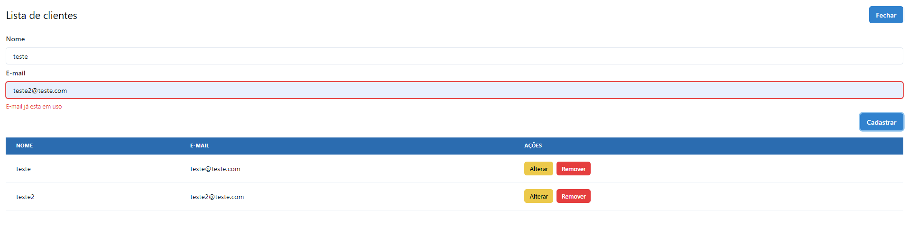

🚩 O desafio
Criar Sistema CRUD com next e typescript .

🛠 Tecnologias utilizadas
⚛️ React — Single page application
⚛️ Next — Single page application
⚛️ TypesCript - Tipagem do projeto
💅 Chakra UI — Estilização dos componente
🚀 Rodando o projeto
Pré-requisitos
Git
NodeJS
Yarn
🖥 Rodando a aplicação
Clone o repositório

Instala as dependências
npm install

Inicia a aplicação
yarn start

# Imagem da tela inicial da Aplicacao

